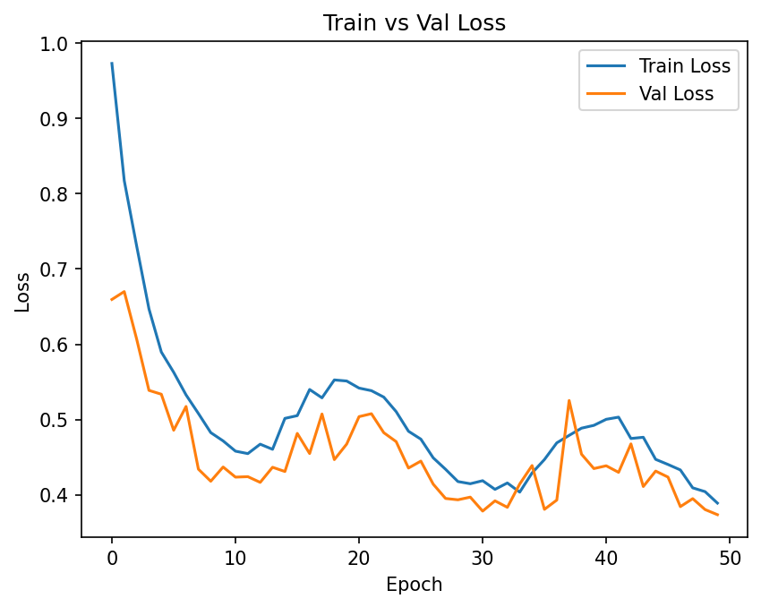
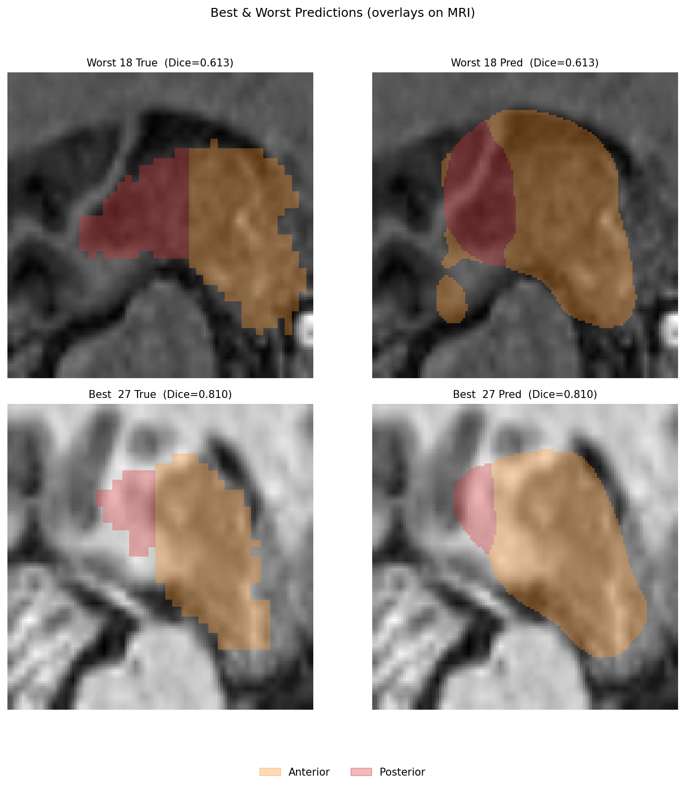

# 3D MRI Hippocampus Segmentation (2D U-Net Case Study)

This repository demonstrates a **lightweight, reproducible deep learning pipeline** for segmenting the **anterior** and **posterior** hippocampus from **3D T1-weighted MRI** volumes using a **2D U-Net** with a **MobileNetV3-Small encoder**.

The project forms part of the author’s MSc Health Data Science coursework at **UCL**, developed for the module *Advanced Machine Learning in Healthcare (CHME0035)*.

---
- 🌐 **HTML case study**:
  - Direct (relative): [project.html](project.html)
  - One-click viewer (recommended if browsing on GitHub):  
    https://htmlpreview.github.io/?https://raw.githubusercontent.com/cianmcguinn/hippocampus-segmentation-project/main/project.html

---

## 🧠 Project Overview

Manual hippocampus segmentation is slow and requires neuro-anatomical expertise.  
This project automates the process using a compact, transfer-learning-based CNN architecture designed for **high accuracy on limited data and compute**.

### Key Features
- **Model:** 2D U-Net + MobileNetV3-Small encoder (ImageNet-pretrained)  
- **Loss:** Hybrid Dice + weighted Cross-Entropy  
- **Pre-processing:** N4 bias correction, z-score normalisation, ROI cropping  
- **Reproducibility:** Full seeding across Python, NumPy, PyTorch, and DataLoader workers  
- **Evaluation:** 3D Dice / IoU metrics, confusion matrix, qualitative overlays

> The notebook is deterministic and regenerates all metrics and figures on re-run.

---

## 📂 Repository Structure

```
.
├── src/ # Modular helper modules
│ ├── config.py # Centralised configuration (seed, paths, params)
│ ├── data_io.py # Data loading, preprocessing, augmentation
│ ├── metrics.py # Dice/IoU metrics and confusion matrix utilities
│ ├── train.py # Training loop, model creation, and loss functions
│ └── viz/ # Visualisation helpers (curves, overlays, plots)
│
├── reports/ # Lightweight outputs and evaluation artefacts
│ ├── configs/
│ │ └── baseline_unet_best_config.json # Saved best model configuration
│ ├── figures/ # Key result visualisations
│ │ ├── train_val_loss_curve.png
│ │ ├── test_confusion_matrix.png
│ │ ├── overlays_best_worst.png
│ │ └── sample_slices.png
│ ├── test_confusion_matrix.txt
│ └── test_summary.json
│
├── 3DMRI_hippocampus_segmentation.ipynb # Main modular Jupyter notebook
├── project.html # Recruiter-friendly case study (HTML version)
├── requirements.txt # Python dependencies
├── .gitignore # Ignore large or auto-generated files (artifacts, caches)
└── README.md # Project overview and documentation
```

---

## 📊 Results (MobileNetV3 Baseline)

| Metric | Mean ± SD | Notes |
|:--|:--|:--|
| **3D Dice** | 0.73 ± 0.04 | Baseline MobileNetV3 |
| **3D IoU**  | 0.57 ± 0.05 | Baseline MobileNetV3 |

Confusion analysis shows most residual misclassifications occur between anterior and posterior hippocampal regions — anatomically plausible given their proximity.  
Qualitative overlays confirm shape and continuity preservation across slices.

---

### **Training and Evaluation Visuals**

**Model convergence:**  


**Segmentation examples (best vs worst case):**  


---

## 🧩 Reproducibility

- All seeds fixed (`SEED=42` across Python, NumPy, PyTorch, DataLoader workers)  
- Deterministic CuDNN behaviour enforced for consistent re-runs  
- DataLoader uses `worker_init_fn` and `torch.Generator` seeding  

> Identical code execution yields identical results — vital for healthcare ML reproducibility.

---

## ⚙️ Usage

### 1. Clone the repository
```bash
git clone https://github.com/<your-username>/hippocampus_segmentation.git
cd hippocampus_segmentation
```

### 2. Set up environment
```bash
python -m venv .venv
source .venv/bin/activate   # (or .venv\Scripts\activate on Windows)
pip install -r requirements.txt
```

### 3. Run the notebook
Open in Jupyter or Google Colab and execute all cells sequentially:
```bash
jupyter notebook 3DMRI_hippocampus_segmentation.ipynb
```

All generated figures and reports will appear in the `artifacts/` directory.

---

## 🔗 Quick View (HTML Case Study)

For a concise overview of results and visuals, open:  
👉 **[project.html](./project.html)**

This file summarises the pipeline, evaluation metrics, and key findings in a recruiter-friendly format.

---

## 🧭 Future Work
- Extend to 3D or attention-based U-Nets  
- Integrate multi-modal MRI (T1/T2/FLAIR)  
- Add uncertainty estimation for clinical interpretability  
- Evaluate on larger, multi-centre datasets  

---

## 📜 License
This project is released under the **MIT License**. See the LICENSE file for details.

---

**Author:** Cian McGuinn  
**Institution:** University College London (UCL)  
**Programme:** MSc Health Data Science  
**Module:** Advanced Machine Learning in Healthcare (CHME0035)
README (2).md…]()
